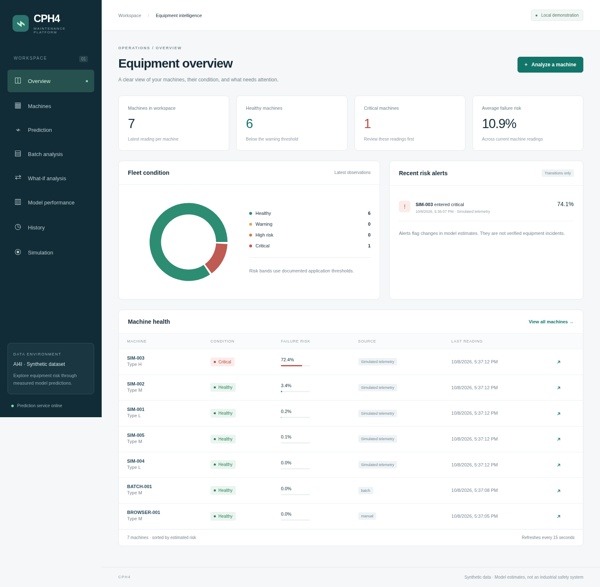
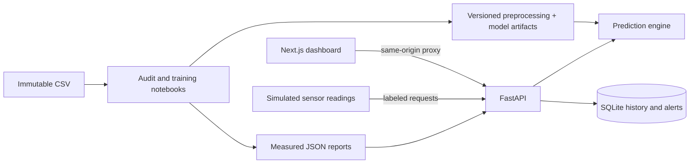

# CPH4 — Predictive Maintenance Platform

**CPH4** is a local equipment-risk workspace backed by an evaluated machine learning pipeline. It includes single-machine predictions, explanations, batch CSV analysis, history, fleet views, model scenarios, simulated telemetry, and saved performance reports.

Data preparation, training, visualization, and scoring live in **Jupyter notebooks**. Production inference and persistence use Python; the dashboard uses Next.js, TypeScript, and React. The project does not infer a validated future warning horizon from this dataset.



## Quick start

Tested with Python 3.14.8, Node.js 24, and pnpm 11. Runtime Python versions are pinned in `requirements.lock.txt`; frontend versions are locked in `frontend/pnpm-lock.yaml`. Use the locked environment when loading saved joblib artifacts.

Clone the repository, then create the Python environment:

```bash
git clone git@github.com:XxCPH4xX/Predictive-Maintenance-AI-Platform.git
cd Predictive-Maintenance-AI-Platform
python3.14 -m venv .venv
source .venv/bin/activate
python -m pip install -r requirements.lock.txt -r requirements-dev.txt
```

The local workspace already contains trained artifacts. A fresh checkout will not include ignored model files: execute the notebooks in order as described below before starting the API.

Start the API:

```bash
python -m uvicorn backend.main:app --host 127.0.0.1 --port 8000
```

In a second terminal:

```bash
cd frontend
pnpm install --frozen-lockfile
pnpm dev
```

Open [the dashboard](http://127.0.0.1:3000). Interactive API documentation is available at [FastAPI docs](http://127.0.0.1:8000/docs). Start with a single prediction, or use **Simulation → Run one interval** to populate an explicitly simulated fleet. A new database starts empty.

For an optimized frontend:

```bash
cd frontend
pnpm build
pnpm start
```

The start script serves the standalone build and its static assets on localhost. Set `FRONTEND_HOST` only when a different bind address is needed. If the API address changes, set `API_URL` before `pnpm build`; the proxy destination is captured at build time.

## Notebook workflow

Open each notebook with the `.venv` Python kernel and run all cells in order. Outputs, measured tables, and figures are already saved in the notebooks.

| Notebook | Purpose |
| --- | --- |
| [01 — Dataset audit and EDA](notebooks/01_dataset_audit_and_eda.ipynb) | Full schema audit, validation, six figures, and interpretation |
| [02 — Validation checks](notebooks/02_validation_checks.ipynb) | 22 checks for raw data and EDA aggregation |
| [03 — Preprocessing](notebooks/03_preprocessing.ipynb) | Frozen partitions and training-only transformations |
| [04 — Baselines](notebooks/04_baseline_models.ipynb) | Logistic Regression and Random Forest |
| [05 — XGBoost](notebooks/05_xgboost.ipynb) | Reproducible comparison against baselines |
| [06 — Optimization](notebooks/06_model_optimization.ipynb) | Weighting, small parameter search, cross-validation, calibration, threshold selection, and final evaluation |
| [07 — Explainability](notebooks/07_explainability.ipynb) | Global and individual SHAP, with an additivity check |
| [08 — Failure types](notebooks/08_failure_types.ipynb) | Separate experimental multilabel model and per-label evaluation |

After training, [09 — Supplied CSV test](notebooks/09_supplied_csv_test.ipynb) runs the original CSV through the saved production pipeline without retraining or writing application history. It exports row-level predictions and separate train/validation/test scores to `reports/predictions/`. Whole-file scores include training observations; use the held-out test results for the existing unseen-row evaluation.

For a fresh reproducible run from the root:

```bash
source .venv/bin/activate
for notebook in notebooks/0[1-8]_*.ipynb; do
  jupyter execute "$notebook" --inplace || break
done
```

Notebook 02 loads tagged definitions from Notebook 01 and collects its visible pytest tests in a temporary file, removed after execution. Later notebooks reuse tagged definitions rather than duplicate preprocessing. No training logic is required in the API.

Notebooks regenerate artifacts and reports. Stop the API before replacing artifacts and restart afterward. Do not repeatedly tune against the final test results. If the raw dataset changes, the frozen split manifest deliberately refuses to match it; create a documented new experiment rather than silently replacing the existing split.

## Dataset and leakage prevention

The immutable input is `data/raw/ai4i2020.csv`. The original root-level upload is also preserved. Its SHA-256 is `dc6630cd9b1f0f853922fad78a1b6436570d3f1ec863f1dd5c4340ac56bc8a8e`.

- 10,000 observations and 14 columns; no missing values or duplicate records.
- 339 binary failures, a prevalence of 3.39%.
- Inputs: Type, air temperature, process temperature, rotational speed, torque, and tool wear.
- Excluded identifiers: UDI and Product ID.
- Excluded failure-state flags: TWF, HDF, PWF, OSF, and RNF. These are never binary model inputs.
- Failure flags overlap in 24 rows. Nine binary failures have no active flag; 18 binary-normal rows have an RNF flag. Original labels are preserved.

The approximately 510 KiB canonical CSV is tracked with attribution. Derived datasets, model binaries, environments, and databases are ignored. Regenerate model artifacts by executing the training notebooks before starting a fresh installation.

Dataset citation: **AI4I 2020 Predictive Maintenance Dataset (2020), UCI Machine Learning Repository**, [DOI 10.24432/C5HS5C](https://doi.org/10.24432/C5HS5C). The [UCI dataset page](https://archive.ics.uci.edu/dataset/601/ai4i+2020+predictive+maintenance+dataset) identifies it as synthetic and licensed under CC BY 4.0. The supplied source is [the Kaggle mirror](https://www.kaggle.com/datasets/stephanmatzka/predictive-maintenance-dataset-ai4i-2020).

See the [measured audit](reports/dataset_audit.md), [initial decisions](reports/milestone_1.md), and [EDA findings](reports/milestone_2.md).

## ML methodology and measured results

Partitions are 60% training, 20% validation, and 20% testing, stratified with seed 42. Numeric scaling is fitted only on training rows. Type is explicitly one-hot encoded; a column allowlist prevents leakage. Complete preprocessing/classification pipelines are saved together.

The progression is Logistic Regression → Random Forest → XGBoost → a bounded weighting/depth search. Selection uses validation average precision. Training-only stratified and CSV-block cross-validation assess sensitivity to ordering. Sigmoid calibration was evaluated but rejected because validation Brier score worsened. No resampling or SMOTE was used.

The selected candidate is `xgboost_depth4`. Its operating threshold, approximately **0.08568**, maximizes validation precision among thresholds reaching at least 90% validation recall. The pipeline and threshold were frozen before final test evaluation. The model was not subsequently refitted or tuned against test results.

| Final test measure | Result |
| --- | ---: |
| Precision | 40.56% |
| Recall | 85.29% |
| F1 | 0.5498 |
| ROC-AUC | 0.9806 |
| PR-AUC / average precision | 0.7706 |
| Brier score | 0.01344 |
| Missed failures | 10 of 68 |
| False alarms | 85 |

Test confusion matrix, actual rows and predicted columns: `[[1847, 85], [10, 58]]`. The validation recall objective did **not** fully transfer to the test set. PR-AUC in this project means average precision, not trapezoidal integration.

The separate failure-type component uses the same six inputs and retains overlapping targets. TWF and RNF had zero test recall at the fixed 0.5 threshold; their estimates must not be presented as reliable diagnoses. See [the model card](reports/model_card.md) for the comparison, rare-label results, and generalization limitations.

All dashboard metrics load from `reports/metrics/`; there are no manually typed performance values in frontend components.

## Application features

- **Overview / Machines:** latest stored readings, risk distribution, machine details, and upward-transition alerts.
- **Prediction:** validated readings, estimated failure probability, risk level, SHAP explanation, and experimental failure-type signals.
- **Batch analysis:** UTF-8 CSV, a 2 MiB stream limit, up to 500 records, row-specific errors, and downloadable results including invalid rows. Only valid rows are saved.
- **What-if analysis:** debounced requests to the same production pipeline, without modifying history. These are model scenarios, not causal intervention estimates.
- **Simulation:** seeded, changing sensor readings sent to the actual prediction endpoint every five seconds while enabled. SIM identifiers and source labels distinguish simulated data. Leaving the page stops new intervals.
- **History:** timestamp, input readings, probability, class, risk band, source, and model version stored in SQLite.
- **Model performance:** comparison, final confusion matrix, PR/ROC curves, calibration results, grouped checks, and global SHAP contributions.

Risk thresholds are stored in `models/metadata.json`: warning = half the selected decision threshold; high risk = the decision threshold; critical = the decision threshold plus 60% of its remaining distance to 1. These are application demonstration bands, not industrial standards. SHAP values are contributions to XGBoost log-odds, not probability percentage points or causal effects.

## Architecture



The inference engine loads only local, checksum-verified model files. The platform does not accept serialized model uploads. The persistence layer is separate from inference, so a PostgreSQL implementation can replace SQLite without changing ML logic. Stored predictions from a different model version retain their original results; the API does not fabricate explanations from a replacement model.

```text
notebooks/             Data preparation, training, evaluation, and figures
backend/               Schemas, inference, FastAPI, SQLite, CSV parsing, simulation
frontend/              Next.js application, reusable components, browser tests
tests/                 Inference, API, persistence, and simulator checks
data/raw/              Immutable supplied CSV
data/processed/        Frozen split manifest (local, generated)
models/                Trusted generated pipelines, explainer, metadata (local)
reports/metrics/        Saved experiment and evaluation JSON
reports/figures/        Audit, EDA, model, and SHAP figures
reports/screenshots/    Browser captures of real application responses
compose.yaml           Backend, frontend, and a persistent history volume
```

## API usage

```bash
curl -X POST http://127.0.0.1:8000/predict \
  -H 'Content-Type: application/json' \
  -d '{"machine_id":"M-104","machine_type":"M","air_temperature":300.1,"process_temperature":310.4,"rotational_speed":1450,"torque":44.8,"tool_wear":125}'
```

| Endpoint | Purpose |
| --- | --- |
| `GET /health` | Model readiness and version |
| `GET /model/info` | Features, threshold policy, training ranges, limitations |
| `GET /model/performance` | Saved evaluation and explanation reports |
| `POST /predict` | Predict, explain, and persist; `source: "scenario"` skips persistence |
| `POST /explain` | Explain without saving a prediction |
| `POST /predict/batch` | Raw UTF-8 CSV request body; not a multipart upload |
| `GET /batch/template` | Download the accepted input format |
| `GET /predictions` | Paginated history; optional machine identifier filter |
| `GET /predictions/{id}` | One stored prediction and a matching-model explanation |
| `GET /fleet` | Latest machine state and recent transition alerts |
| `POST /simulation/readings` | Generate explicitly simulated inputs; no risk calculation |

Batch CSV fields are `machine_type,air_temperature,process_temperature,rotational_speed,torque,tool_wear`, plus optional `machine_id`. The full training CSV is intentionally rejected because it contains targets and unsupported identifiers.

```bash
curl http://127.0.0.1:8000/batch/template -o machine_readings.csv
curl -X POST http://127.0.0.1:8000/predict/batch \
  -H 'Content-Type: text/csv' --data-binary @machine_readings.csv
```

Validation bounds are broad application input checks, not engineering limits: air temperature 200–450 K, process temperature 200–550 K, speed 100–10,000 rpm, torque >0–500 Nm, and wear 0–10,000 min. Predictions outside observed training ranges receive warnings.

Configuration: `MODEL_DIR`, `DATABASE_PATH`, and `CORS_ORIGINS` configure the backend; `API_URL` configures the frontend proxy at build time. There are no embedded secrets. Defaults bind the local app to localhost. This demonstration does not implement authentication or rate limiting and should not be exposed as a public industrial service.

## Tests and checks

```bash
source .venv/bin/activate
jupyter execute notebooks/02_validation_checks.ipynb --inplace
python -m pytest tests -q
ruff check backend tests
ruff format --check backend tests
python -m pip check

cd frontend
pnpm lint
pnpm typecheck
pnpm format:check
pnpm build
pnpm exec playwright install chromium
pnpm test:e2e
```

Start both services before browser tests. Use a separate database for test runs, for example `DATABASE_PATH=/tmp/sentinel-browser.sqlite3` when launching Uvicorn. The browser checks submit real predictions and simulated readings, verify scenario isolation and batch errors/downloads, and check desktop/mobile rendering. `WEB_URL` can point the browser suite to another running frontend.

The notebook validation suite contains 22 checks; the backend suite contains 24 tests; the browser suite covers five complete workflows. Upstream SHAP/Matplotlib and Starlette/httpx deprecation warnings do not affect the measured results. ESLint is pinned to the version compatible with the Next.js lint plugins.

## Docker

Generate local model artifacts first, then:

```bash
docker compose up --build
```

Open [localhost:3000](http://localhost:3000). The API is on localhost:8000. A named volume retains prediction history; `docker compose down` stops the services without deleting that volume. The backend runs as a non-root user, verifies artifact checksums at startup, and provides a health check. The frontend image contains the standalone application. Containers do not train models or execute notebooks.

The image build uses pinned runtime dependencies, while base-image tags remain updateable. `API_URL=http://backend:8000` is supplied during the frontend image build. Docker-compatible images are also runnable with Podman; verification details are recorded in [the milestone report](reports/milestones.md).

## Screenshots

The captures use genuine API responses from browser checks. SIM machines contain explicitly generated telemetry; other example rows are submitted through the real prediction and batch flows.

- [Equipment overview](reports/screenshots/overview.png)
- [Single-machine prediction](reports/screenshots/prediction.png)
- [Measured model performance](reports/screenshots/performance.png)
- [Mobile overview](reports/screenshots/mobile-overview.png)

## Limitations and future work

This synthetic dataset demonstrates ML engineering concepts. Results do not replace real maintenance systems or guarantee performance on real machines. Labels describe failure at an observation, with no timestamp, verified repeated-machine identity, remaining useful life, or future prediction horizon.

Full-dataset EDA precedes splitting and exposes aggregate information about later test rows. Training-only grouped PR-AUC fell to approximately 0.49–0.59, compared with 0.73–0.76 in stratified folds, demonstrating sensitivity to operating regimes. High recall comes with substantial false alarms. Probabilities remain uncalibrated because the tested calibration method did not improve validation results.

Future work should prioritize an external, timestamped dataset; a justified warning horizon; cost-based threshold selection; better supported failure-type labels; drift monitoring; authenticated access; and PostgreSQL when deployment needs justify it. These are future improvements, not implemented claims.
