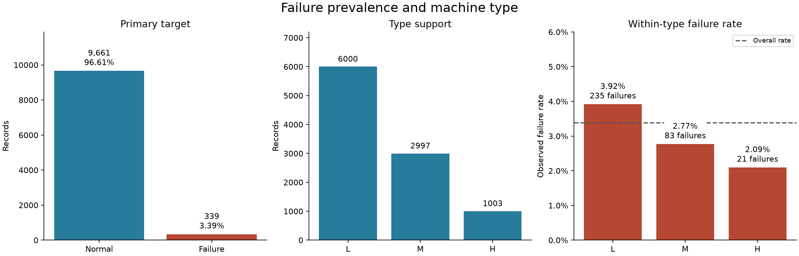
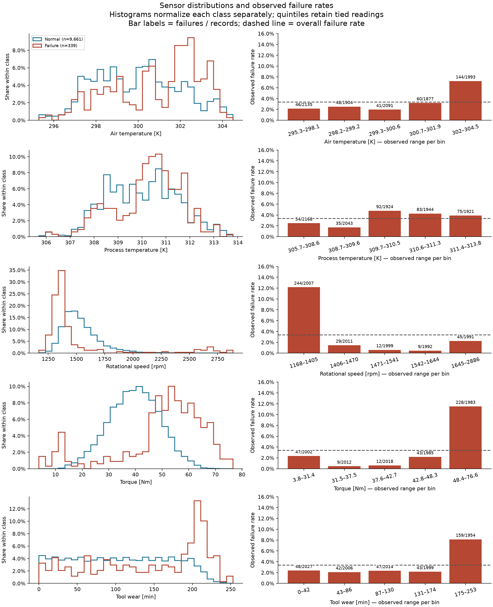
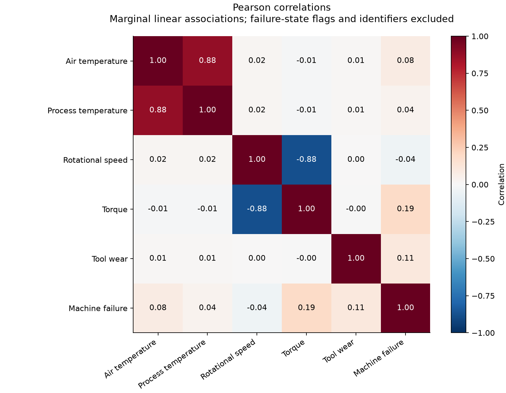
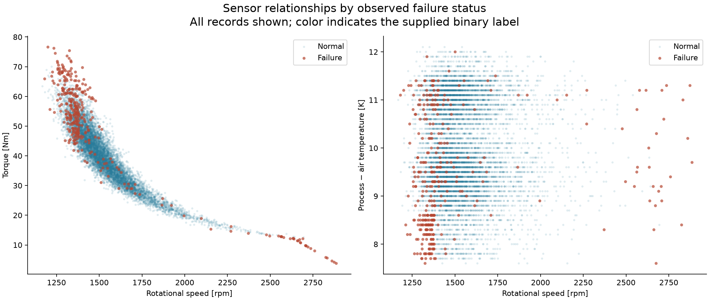
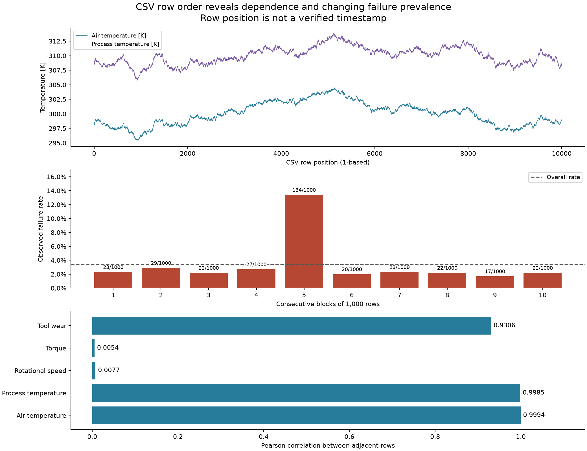
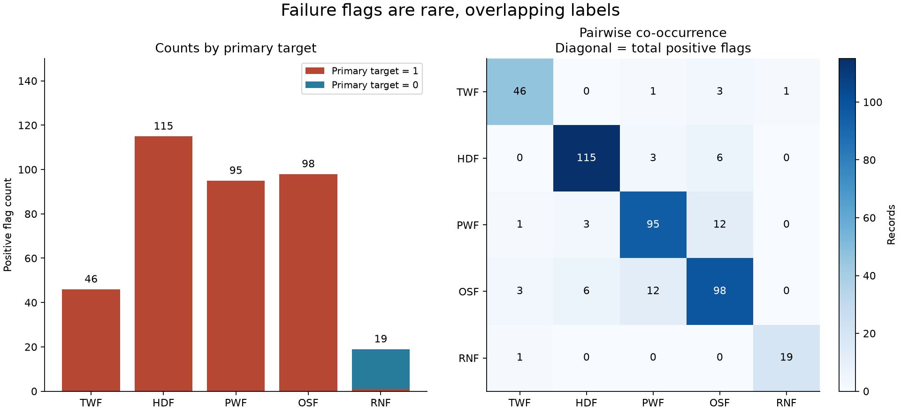

# Milestone 2 — Exploratory data analysis

## Reproduction and scope

Run all cells in [the audit and EDA notebook](../notebooks/01_dataset_audit_and_eda.ipynb) to recreate the audit, [the numerical summary](eda_summary.json), and six PNG figures. All analysis code is included in that notebook, with no imports from project Python modules. All measurements below come from the supplied 10,000-row CSV. The JSON includes the source SHA-256 and library versions. Matplotlib is the new analysis dependency, used for static figures through its headless Agg backend. Development dependencies also include nbformat, nbclient, and ipykernel for notebook validation and execution.

No model, preprocessing pipeline, split, resampling procedure, threshold, or fitted feature transformation was created. Raw data and the Milestone 1 audit remain unchanged.

## Imbalance and machine type

Failures account for 339/10,000 observations (3.39%). Always predicting normal would label 96.61% of these observations correctly while detecting zero failures; this arithmetic illustrates why accuracy alone is unsuitable. It is not a trained model result.

| Type | Records | Failures | Within-type failure rate |
| --- | ---: | ---: | ---: |
| L | 6,000 | 235 | 3.92% |
| M | 2,997 | 83 | 2.77% |
| H | 1,003 | 21 | 2.09% |

Type L contributes the most failures partly because it is the most frequent type, but its within-type rate is also higher. Type remains a useful candidate input. These are unadjusted descriptive comparisons, not causal effects or statistical significance claims; Type H has only 21 failures.

## Sensors and failure relationships

Histograms use shared bin edges and normalize each target class separately, so the much larger normal class does not hide the distribution of failures. The right-hand panels show observed failure rates across empirical sensor quintiles. Ties remain together, so groups are not exactly equal in size; labels display failures/records, and x-axis ranges are the actual minimum and maximum readings in each group. These exploratory bins are not preprocessing or operational thresholds.

| Observation | Failures / records | Observed rate |
| --- | ---: | ---: |
| Highest air-temperature group, 302–304.5 K | 144 / 1,993 | 7.23% |
| Lowest speed group, 1,168–1,405 rpm | 244 / 2,007 | 12.16% |
| Highest torque group, 48.4–76.6 Nm | 228 / 1,983 | 11.50% |
| Highest wear group, 175–253 min | 159 / 1,954 | 8.14% |

Air temperature has a higher failure rate in its upper range. Process temperature has a weaker and nonmonotonic marginal relationship: its five groups have failure rates of approximately 2.49%, 1.71%, 4.78%, 4.27%, and 3.90%. Speed is right-skewed, and failure observations occur at both low and high speeds. Torque is concentrated near 40 Nm for normal observations, while failures occur more often at high torque and also in the low-torque tail. Failures become more common in the highest tool-wear group. A single linear coefficient or monotonic rule may miss these relationships.

IQR screening flags 418 speed readings, including 35 failures (8.37%), and 69 torque readings, including 62 failures (89.86%). Automatically deleting these observations could remove useful failure examples. Retain all readings; the fences are descriptive and do not define invalid measurements.

## Correlations and interactions

Air and process temperatures have Pearson correlation 0.8761. Torque and rotational speed have correlation −0.8750. These dependencies matter when interpreting later model coefficients and explanations. They are not a reason to discard a sensor automatically.

The strongest individual linear association with the binary target among these sensors is torque (0.1913). Speed has a weak marginal correlation (−0.0442) despite its pronounced quintile differences. A weak Pearson value does not establish that a feature lacks predictive value, especially with nonlinear and interacting relationships.

The interaction figure shows failures across the speed–torque relationship and a concentration of failure observations at low speed with a small process-to-air temperature gap. The gap is calculated only for visualization; it has not been added to the input schema. Any later engineered feature must be tested using the training and validation protocol, without using failure flags as inputs. Scatter plots contain every row, with normal observations drawn transparently to reduce overplotting; visual density is not an estimated failure probability.

## Row-order dependence and evaluation implications

Adjacent-row correlations in the supplied CSV are 0.9994 for air temperature, 0.9985 for process temperature, and 0.9306 for tool wear. Speed and torque show much smaller lag-one correlations (0.0077 and 0.0054). These results demonstrate ordering dependence but do not establish elapsed time, a sampling frequency, or repeated observations of a known machine.

Consecutive 1,000-row blocks have failure rates from 1.7% to 13.4%. Rows 4,001–5,000 contain 134 failures and 108 of the 115 HDF flags. HDF positives appear only in blocks 4 and 5. A random stratified split can distribute closely related process regimes across partitions, making it a limited assessment of generalization to a new operating regime. Conversely, a holdout consisting only of the last blocks would contain no HDF positives and could not evaluate that failure mode adequately.

For Milestone 3, retain a reproducible stratified split as the in-distribution baseline and specify a separate order-aware robustness protocol before model comparison. Record target and failure-mode support in each partition, without using those flags as predictors. Contiguous blocks or forward validation within the development data can examine sensitivity to order; any gap between blocks should have a documented rationale. Do not cherry-pick block boundaries to improve scores, and do not call row order verified real-world chronology. Keep test partitions fixed and exclude them from fitting, tuning, threshold selection, and feature selection.

This milestone explores the full dataset before splitting, as requested by the roadmap. Future test partitions will therefore be held out from model development, but will not be completely unseen at the exploratory level. Disclose that limitation in evaluation; a fresh external dataset would be needed for stronger independent confirmation.

## Failure-type frequencies and overlap

| Flag | Positive records | Primary failure = 1 | Primary failure = 0 |
| --- | ---: | ---: | ---: |
| TWF | 46 | 46 | 0 |
| HDF | 115 | 115 | 0 |
| PWF | 95 | 95 | 0 |
| OSF | 98 | 98 | 0 |
| RNF | 19 | 1 | 18 |

The co-occurrence matrix counts both pair-only and multi-flag rows. For example, PWF and OSF co-occur in 12 rows: 11 pair-only rows plus one row also labeled TWF. Across the dataset, 24 rows have multiple flags. Counts across labels cannot be summed to obtain the number of failed machines.

RNF is both rare and inconsistent with the primary target in 18 of its 19 positive rows. Nine primary failures have no positive flag, as documented in the initial audit. Preserve the original labels and defer the separate multilabel component until the binary model has been completed and evaluated. Rare-label performance will need careful support reporting.

## Decisions, checks, and next milestone

Retain the six original candidate inputs, all observations, and all original labels. Continue excluding identifiers and failure flags. Preserve sensor units, fit transformations only on training data, and evaluate both imbalance and ordering effects. Descriptive associations do not establish causation or a future warning horizon, and this synthetic dataset cannot establish industrial effectiveness.

Created: the audit/EDA and validation notebooks, `reports/eda_summary.json`, this report, and six figures. Modified: dependency files, pytest configuration, README, and the Milestone 1 documentation to reflect the notebook-only format. All former Python modules and test files were migrated into the two notebooks and removed. Both notebooks execute from fresh kernels. The validation notebook passes 22 pytest cases, including four new checks for group denominators, tied quantile bins, count reconciliation/data preservation, and CSV-position blocks with a partial final block. Dependency checks pass. All six figures were visually inspected for labels, legends, and layout.

The agreed format is Jupyter notebooks for data preparation, training, visualization, and scoring; ordinary Python or frontend source files will support the prediction platform in later milestones.

Next: Milestone 3 — reusable preprocessing and documented train/validation/test strategy in a notebook. No part of that milestone is implemented here.
